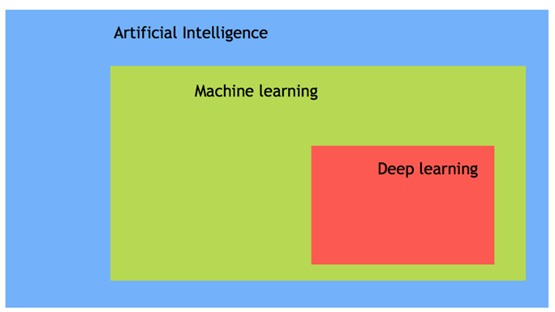

Artificial Intelligence
---

## [1. What is AI](#what)
## [2. Type of Artificial Intelligence](#classification)
## [3. Use Cases](#usecases)
## [4. References](#references)
---

## 1. What is AI?
A machine with the ability to perform cognitive functions such as perceiving, learning, reasoning and solve problems are deemed to hold an artificial intelligence. Artificial intelligence exists when a machine has cognitive ability. The benchmark for AI is the human level concerning reasoning, speech, and vision.
 
AI has three different levels:
- _Narrow AI_: A artificial intelligence is said to be narrow when the machine can perform a specific task better than a human. The current research of AI is here now
- _General AI_: An artificial intelligence reaches the general state when it can perform any intellectual task with the same accuracy level as a human would
- _Strong AI_: An AI is strong when it can beat humans in many tasks
 
Nowadays, AI is used in almost all industries, giving a technological edge to all companies integrating AI at scale. According to McKinsey, AI has the potential to create 600 billions of dollars of value in retail, bring 50 percent more incremental value in banking compared with other analytics techniques. In transport and logistic, the potential revenue jump is 89 percent more.
 
Concretely, if an organization uses AI for its marketing team, it can automate mundane and repetitive tasks, allowing the sales representative to focus on tasks like relationship building, lead nurturing, etc. A company name Gong provides a conversation intelligence service. Each time a Sales Representative make a phone call, the machine records transcribes and analyzes the chat. The VP can use AI analytics and recommendation to formulate a winning strategy.
 
In a nutshell, AI provides a cutting-edge technology to deal with complex data which is impossible to handle by a human being. AI automates redundant jobs allowing a worker to focus on the high level, value-added tasks. When AI is implemented at scale, it leads to cost reduction and revenue increase.

## 2. Type of Artificial Intelligence
Artificial intelligence can be divided into three subfields:
- Artificial intelligence
- Machine learning
- Deep learning

### 2.1. Machine Learning
Machine learning is the art of study of algorithms that learn from examples and experiences.

Machine learning is based on the idea that there exist some patterns in the data that were identified and used for future predictions.

The difference from hardcoding rules is that the machine learns on its own to find such rules.

### 2.2. Deep learning
Deep learning is a sub-field of machine learning. Deep learning does not mean the machine learns more in-depth knowledge; it means the machine uses different layers to learn from the data. The depth of the model is represented by the number of layers in the model. For instance, Google LeNet model for image recognition counts 22 layers.

In deep learning, the learning phase is done through a neural network. A neural network is an architecture where the layers are stacked on top of each other.

### 2.3. AI vs. Machine Learning
Most of our smartphone, daily device or even the internet uses Artificial intelligence. Very often, AI and machine learning are used interchangeably by big companies that want to announce their latest innovation. However, Machine learning and AI are different in some ways.
 
AI- artificial intelligence- is the science of training machines to perform human tasks. The term was invented in the 1950s when scientists began exploring how computers could solve problems on their own.

Artificial Intelligence is a computer that is given human-like properties. Take our brain; it works effortlessly and seamlessly to calculate the world around us. Artificial Intelligence is the concept that a computer can do the same. It can be said that AI is the large science that mimics human aptitudes.
 
Machine learning is a distinct subset of AI that trains a machine how to learn. Machine learning models look for patterns in data and try to conclude. In a nutshell, the machine does not need to be explicitly programmed by people. The programmers give some examples, and the computer is going to learn what to do from those samples.

## 3. USE CASES
AI has broad applications:
- **Reduce or avoid the repetitive task.** 
For instance, AI can repeat a task continuously, without fatigue. In fact, AI never rests, and it is indifferent to the task to carry out
- **Improves an existing product.** 
Before the age of machine learning, core products were building upon hard-code rule. Firms introduced artificial intelligence to enhance the functionality of the product rather than starting from scratch to design new products. You can think of a Facebook image. A few years ago, you had to tag your friends manually. Nowadays, with the help of AI, Facebook gives you a friend's recommendation.

 
AI is used in all the industries, from marketing to supply chain, finance, food-processing sector. According to a McKinsey survey, financial services and high tech communication are leading the AI fields.

