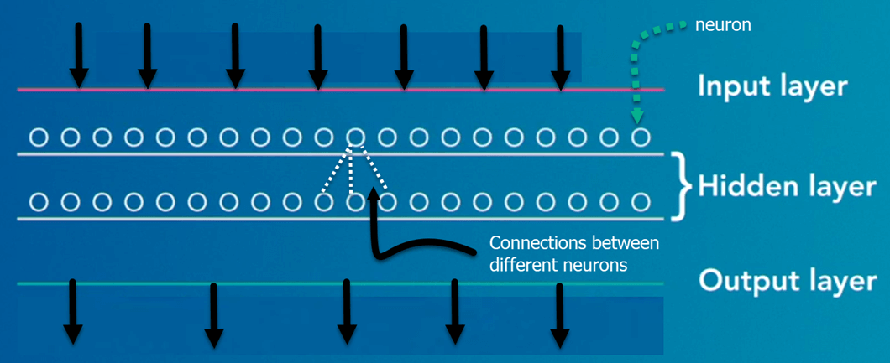
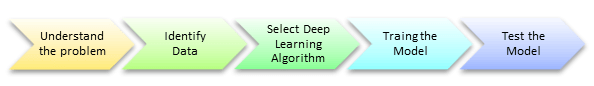
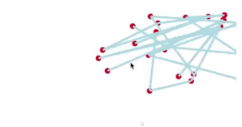
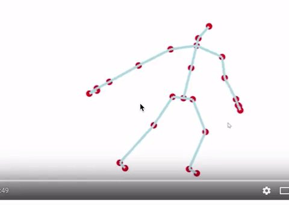
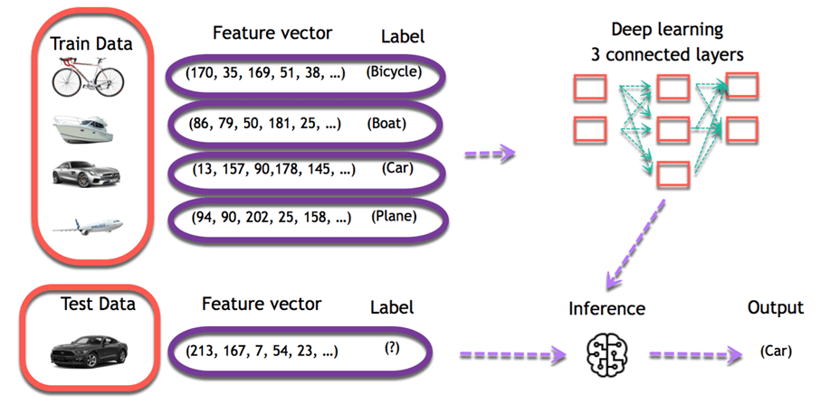
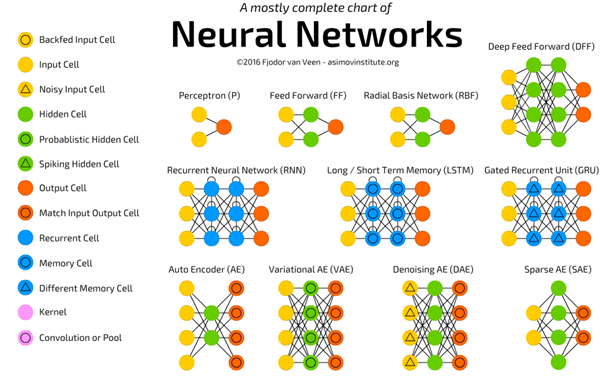
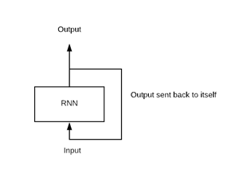
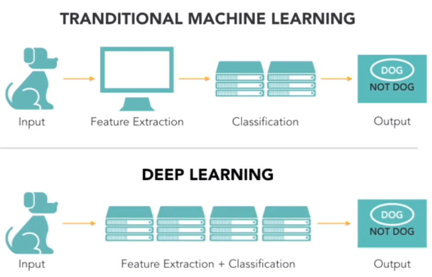

DEEP LEARNING
---

## [1. What is Deep Learning](#what)
## [2. Deep Learning Process](#how)
## [3. Classification of Neural Networks](#classification)
## [4. Types of Deep Learning Networks](#types)
## [5. Use Cases](#usecases)
## [6. References](#references)
---

## 1. What is Deep learning?
Deep learning is a computer software that mimics the network of neurons in a brain. 
It is a subset of machine learning and is called deep learning because it makes use of deep neural networks.
In deep learning, the learning phase is done through a neural network. 
A neural network is an architecture where the layers are stacked on top of each other

Deep learning algorithms are constructed with connected layers.
- The first layer is called the Input Layer
- The last layer is called the Output Layer
- All layers in between are called Hidden Layers.
	The word deep means the network join neurons in more than two layers.
	Each Hidden layer is composed of neurons. The neurons are connected to each other. The neuron will process and then propagate the input signal it receives the layer above it. The strength of the signal given the neuron in the next layer depends on the weight, bias and activation function.

The network consumes large amounts of input data and operates them through multiple layers; the network can learn increasingly complex features of the data at each layer.

**_Difference between Machine Learning and Deep Learning_**:

|		|Machine Learning 		|Deep learning 			|
|-------|-----------------------|-----------------------|
|Data Dependencies 	|Excellent performances on a small/medium dataset	|Excellent performance on a big dataset 	|
|Hardware dependencies 	|Work on a low-end machine.		|Requires powerful machine, preferably with GPU: DL performs a significant amount of matrix multiplication 		|
|Feature engineering 	|Need to understand the features that represent the data 	|No need to understand the best feature that represents the data 	|
|Execution time 	|From few minutes to hours 	|Up to weeks. Neural Network needs to compute a significant number of weights 	|
|Interpretability 	|Some algorithms are easy to interpret (logistic, decision tree), some are almost impossible (SVM, XGBoost) 	|Difficult to impossible 	|

## 2. Deep learning Process
A deep neural network provides state-of-the-art accuracy in many tasks, from object detection to speech recognition. 
They can learn automatically, without predefined knowledge explicitly coded by the programmers.

To grasp the idea of deep learning, imagine a family, with an infant and parents. 
The toddler points objects with his little finger and always says the word 'cat.' 
As its parents are concerned about his education, they keep telling him 'Yes, that is a cat' or 'No, that is not a cat.' 
The infant persists in pointing objects but becomes more accurate with 'cats.' 
The little kid, deep down, does not know why he can say it is a cat or not. 
He has just learned how to hierarchies complex features coming up with a cat by looking at the pet overall and continue to focus on details such as the tails or the nose before to make up his mind.

A neural network works quite the same. Each layer represents a deeper level of knowledge, i.e., the hierarchy of knowledge. A neural network with four layers will learn more complex feature than with that with two layers.

The learning occurs in two phases.
- The first phase consists of applying a nonlinear transformation of the input and create a statistical model as output.
- The second phase aims at improving the model with a mathematical method known as derivative.

The neural network repeats these two phases hundreds to thousands of time until it has reached a tolerable level of accuracy. 
The repeat of this two-phase is called an iteration.

To give an example, take a look at the motion below, the model is trying to learn how to dance. 
After 10 minutes of training, the model does not know how to dance, and it looks like a scribble.

After 48 hours of learning, the computer masters the art of dancing.

Each input goes into a neuron and is multiplied by a weight. The result of the multiplication flows to the next layer and become the input. This process is repeated for each layer of the network. The final layer is named the output layer; it provides an actual value for the regression task and a probability of each class for the classification task. The neural network uses a mathematical algorithm to update the weights of all the neurons. The neural network is fully trained when the value of the weights gives an output close to the reality. For instance, a well-trained neural network can recognize the object on a picture with higher accuracy than the traditional neural net.

## 3. Classification of Neural Networks
1. Shallow neural network: The Shallow neural network has only one hidden layer between the input and output.
2. Deep neural network: Deep neural networks have more than one layer. 
For instance, Google LeNet model for image recognition counts 22 layers.

Nowadays, deep learning is used in many ways like a driverless car, mobile phone, Google Search Engine, Fraud detection, TV, and so on.

## 4. Types of Deep Learning Networks

### 4.1. Feed-forward neural networks
The simplest type of artificial neural network. 
With this type of architecture, information flows in only one direction, forward. 
It means, the information's flows starts at the input layer, goes to the "hidden" layers, and end at the output layer. 
The network does not have a loop. 
Information stops at the output layers.

### 4.2. Recurrent neural networks (RNNs)
RNN is a multi-layered neural network that can store information in context nodes, allowing it to learn data sequences and output a number or another sequence. 
In simple words it an Artificial neural networks whose connections between neurons include loops. 
RNNs are well suited for processing sequences of inputs.

Example, if the task is to predict the next word in the sentence "Do you want a…………?
- The RNN neurons will receive a signal that point to the start of the sentence.
- The network receives the word "Do" as an input and produces a vector of the number. This vector is fed back to the neuron to provide a memory to the network. This stage helps the network to remember it received "Do" and it received it in the first position.
- The network will similarly proceed to the next words. It takes the word "you" and "want." The state of the neurons is updated upon receiving each word.
- The final stage occurs after receiving the word "a." The neural network will provide a probability for each English word that can be used to complete the sentence. A well-trained RNN probably assigns a high probability to "café," "drink," "burger," etc.

**Common uses of RNN**:
- Help securities traders to generate analytic reports
- Detect abnormalities in the contract of financial statement
- Detect fraudulent credit-card transaction
- Provide a caption for images
- Power chatbots
- The standard uses of RNN occur when the practitioners are working with time-series data or sequences (e.g., audio recordings or text).

### 4.3 Convolutional neural networks (CNN)
CNN is a multi-layered neural network with a unique architecture designed to extract increasingly complex features of the data at each layer to determine the output. 
CNN's are well suited for perceptual tasks.
CNN is mostly used when there is an unstructured data set (e.g., images) and the practitioners need to extract information from it
For instance, if the task is to predict an image caption:
- The CNN receives an image of let's say a cat, this image, in computer term, is a collection of the pixel. Generally, one layer for the greyscale picture and three layers for a color picture.
- During the feature learning (i.e., hidden layers), the network will identify unique features, for instance, the tail of the cat, the ear, etc.
- When the network thoroughly learned how to recognize a picture, it can provide a probability for each image it knows. The label with the highest probability will become the prediction of the network.

### 4.4. Reinforcement Learning
Reinforcement learning is a subfield of machine learning in which systems are trained by receiving virtual "rewards" or "punishments," essentially learning by trial and error. 
Google's DeepMind has used reinforcement learning to beat a human champion in the Go games. 
Reinforcement learning is also used in video games to improve the gaming experience by providing smarter bot.

One of the most famous algorithms are:
- Q-learning
- Deep Q network
- State-Action-Reward-State-Action (SARSA)
- Deep Deterministic Policy Gradient (DDPG)

## 5. Applications/ Examples of deep learning applications
- AI in Finance: The financial technology sector has already started using AI to save time, reduce costs, and add value. Deep learning is changing the lending industry by using more robust credit scoring. Credit decision-makers can use AI for robust credit lending applications to achieve faster, more accurate risk assessment, using machine intelligence to factor in the character and capacity of applicants.
 
Underwrite is a Fintech company providing an AI solution for credit makers company. underwrite.ai uses AI to detect which applicant is more likely to pay back a loan. Their approach radically outperforms traditional methods.

- AI in HR: Under Armour, a sportswear company revolutionizes hiring and modernizes the candidate experience with the help of AI. In fact, Under Armour Reduces hiring time for its retail stores by 35%. Under Armour faced a growing popularity interest back in 2012. They had, on average, 30000 resumes a month. Reading all of those applications and begin to start the screening and interview process was taking too long. The lengthy process to get people hired and on-boarded impacted Under Armour's ability to have their retail stores fully staffed, ramped and ready to operate.
 
At that time, Under Armour had all of the 'must have' HR technology in place such as transactional solutions for sourcing, applying, tracking and onboarding but those tools weren't useful enough. Under armour choose HireVue, an AI provider for HR solution, for both on-demand and live interviews. The results were bluffing; they managed to decrease by 35% the time to fill. In return, the hired higher quality staffs.

### 5.1. Automate Feature Extraction using DL
A dataset can contain a dozen to hundreds of features. The system will learn from the relevance of these features. However, not all features are meaningful for the algorithm. A crucial part of machine learning is to find a relevant set of features to make the system learns something.

One way to perform this part in machine learning is to use feature extraction. Feature extraction combines existing features to create a more relevant set of features. It can be done with PCA, T-SNE or any other dimensionality reduction algorithms.

For example, an image processing, the practitioner needs to extract the feature manually in the image like the eyes, the nose, lips and so on. Those extracted features are feed to the classification model.

Deep learning solves this issue, especially for a convolutional neural network. The first layer of a neural network will learn small details from the picture; the next layers will combine the previous knowledge to make more complex information. In the convolutional neural network, the feature extraction is done with the use of the filter. The network applies a filter to the picture to see if there is a match, i.e., the shape of the feature is identical to a part of the image. If there is a match, the network will use this filter. The process of feature extraction is therefore done automatically.

## 6. References